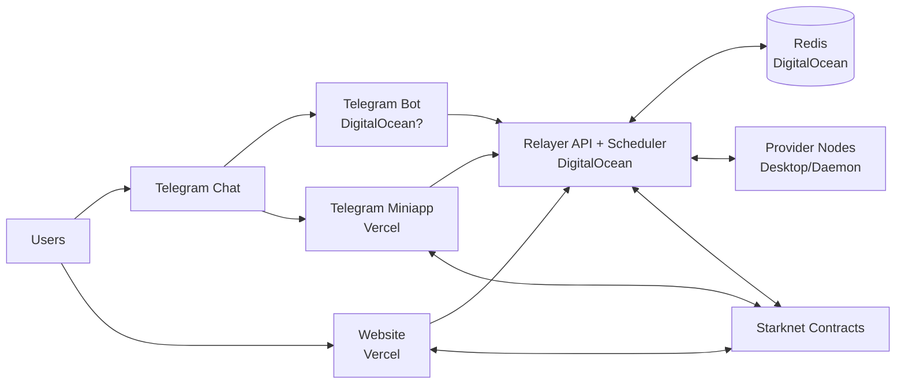
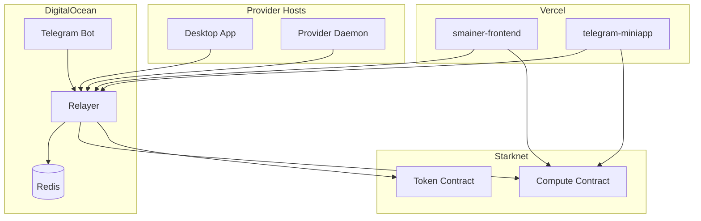

# Smainer Operations Truth Map

Purpose: one always-open file for live verification, testing, and next-step execution.
Audience: human operators across product, infra, and engineering.
Mode: concise, target-oriented, no fluff.

---

## 1) System Map (Who Talks To What)

---

## 2) Runtime Placement (Where Each Component Runs)

| Component | Expected Runtime | Current Intent / Notes |
|---|---|---|
| Relayer | DigitalOcean | Primary coordination backend (API, scheduling, node pool). |
| Provider Daemon | Provider machine(s) | First provider can run on DO or local machine. |
| Windows Desktop App | This PC (Windows host, may use WSL/Ubuntu tooling) | Onboarding + node management UI for provider. |
| Contracts | Starknet Mainnet | Wallet + escrow + payouts + registration logic. |
| Website | Vercel | Public product site + dashboard + provider onboarding pages. |
| Telegram Bot | DigitalOcean (expected) | Status uncertain, must verify service + command response. |
| Telegram Miniapp | Vercel (expected) | Should be deployed and linked in BotFather menu button. |
| Backend (definition) | Relayer + Redis + callbacks | "Backend" is primarily relayer stack; not same as website frontend. |

---

## 3) Critical Deployment Topology (Target State)

---

## 4) Verification Matrix (What Must Be Tested Every Cycle)

### A. Relayer (DO)
Goal: API healthy, Redis connected, nodes visible, scheduler active.

Checks:
1. Health endpoint returns healthy.
2. Node list endpoint returns active nodes.
3. Redis keys for active nodes + heartbeats exist.
4. Task submission accepted and enters queue.

Evidence to capture:
- health response
- node count
- one task id lifecycle

---

### B. Provider Daemon
Goal: node registers, heartbeats continuously, tier + hardware detected.

Checks:
1. Daemon process alive.
2. Registration succeeds against relayer.
3. Heartbeat cadence stable.
4. Hardware payload includes GPU fields when available.

Evidence:
- provider logs for register + heartbeat
- relayer node entry for same node id

---

### C. Windows Desktop App (this PC)
Goal: operator can install, connect wallet, register node, start provider flow.

Checks:
1. Installer exists and downloads from release assets.
2. App launches cleanly.
3. Wallet connection works.
4. Register node action succeeds (no contract/config error).

Evidence:
- installer filename/version
- screenshot of successful registration
- transaction hash (if on-chain registration)

---

### D. Contracts + Wallet Communication
Goal: on-chain calls work for registration/tasks/payout paths.

Checks:
1. Contract addresses configured in frontend/miniapp/relayer.
2. Wallet network is correct chain.
3. Contract read calls succeed.
4. Contract write calls produce tx hash and final state change.

Evidence:
- tx hashes
- explorer links
- readback state after write

---

### E. Website (Vercel)
Goal: no placeholders, clear onboarding, valid links.

Checks:
1. Dashboard loads real/explicitly-live data states (no fake demo metrics).
2. /providers register flow gives actionable status.
3. /download -> /create path works.
4. Download button target resolves to actual release assets.

Evidence:
- live URL screenshots
- link checks (200/302 expected)

---

### F. Telegram Bot (DO, uncertain)
Goal: bot actually responds to commands and task flow works.

Checks:
1. Service active and stable.
2. /start and one prompt respond.
3. Bot can communicate with relayer.
4. No auth/token/webhook conflict errors.

Evidence:
- journal excerpt
- user-visible bot response timestamps

---

### G. Telegram Miniapp (Vercel, uncertain)
Goal: miniapp opens from Telegram without 404 and connects wallet path.

Checks:
1. BotFather menu button URL points to correct Vercel deploy.
2. Miniapp root loads in mobile Telegram.
3. Connect mode works.
4. App opens full interface and can call relayer.

Evidence:
- Telegram mobile screenshot
- miniapp URL and deploy id

---

## 5) Hard Blockers (Must Be True To Claim "Ready")

1. Desktop release assets exist in Smainer/smainer-desktop releases.
2. Frontend + miniapp deployed to current Vercel versions.
3. Telegram bot responds in live chat.
4. At least one active provider node visible in relayer.
5. Register node on providers page succeeds for a real wallet.
6. One end-to-end prompt path completes: Telegram -> Relayer -> Node -> Result.

---

## 6) Daily Operator Runbook (15-Minute Cadence)

Sequence:
1. Verify relayer health + nodes.
2. Verify bot response (/start + one prompt).
3. Verify miniapp open from Telegram menu button.
4. Verify website dashboard and providers registration.
5. Verify installer release presence.
6. Log pass/fail and blockers.

Rule:
- If any step fails, open blocker ticket immediately and stop claiming readiness.

---

## 7) Ownership Map (Execution)

| Area | Primary Owner |
|---|---|
| Relayer / Redis / Scheduling | relayer-architect |
| Provider daemon / host runtime | systems-engineer |
| Desktop app install + onboarding | tauri-desktop-engineer |
| Starknet contracts + tx behavior | starknet-engineer |
| Frontend website | frontend-engineer |
| Telegram bot runtime | systems-engineer + Telegram bot owner |
| Miniapp deployment + UX | frontend-engineer |
| Go/No-Go final decision | chief-director |

---

## 8) Open Questions To Resolve First

1. Telegram bot final runtime host: confirm exact DO host and service name.
2. Miniapp final production URL: confirm exact Vercel project and active deployment.
3. Provider daemon first production host: DO vs local PC final choice.
4. Desktop release strategy: who publishes first installer and when.

---

## 9) Working Rule For Next Sessions

Keep this file open during all implementation and testing.
Update only these sections each cycle:
1. Runtime Placement
2. Verification Matrix evidence lines
3. Hard Blockers status
4. Open Questions

This file is the operational source of truth.
