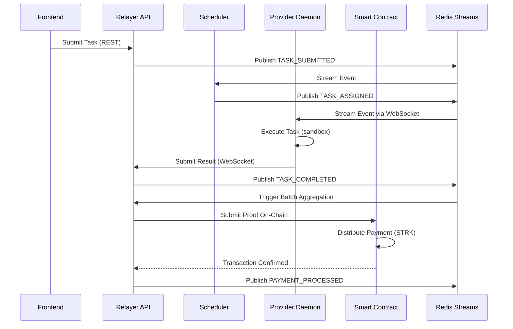
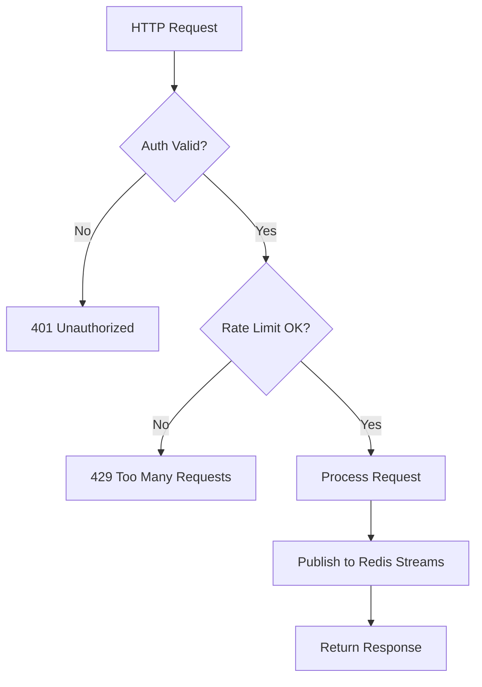
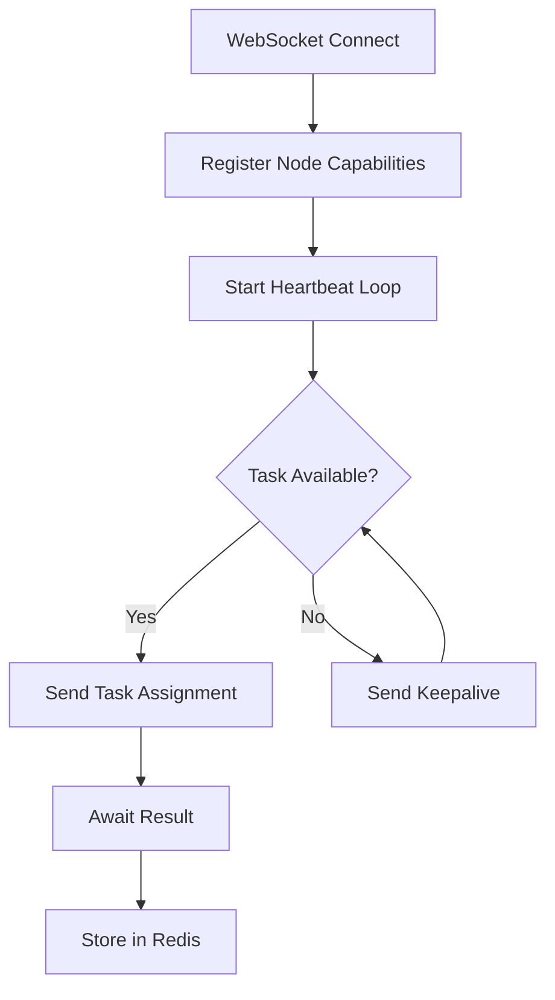
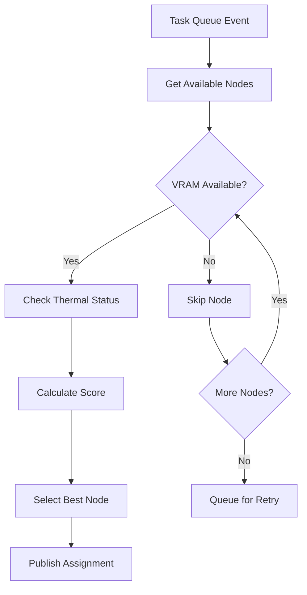
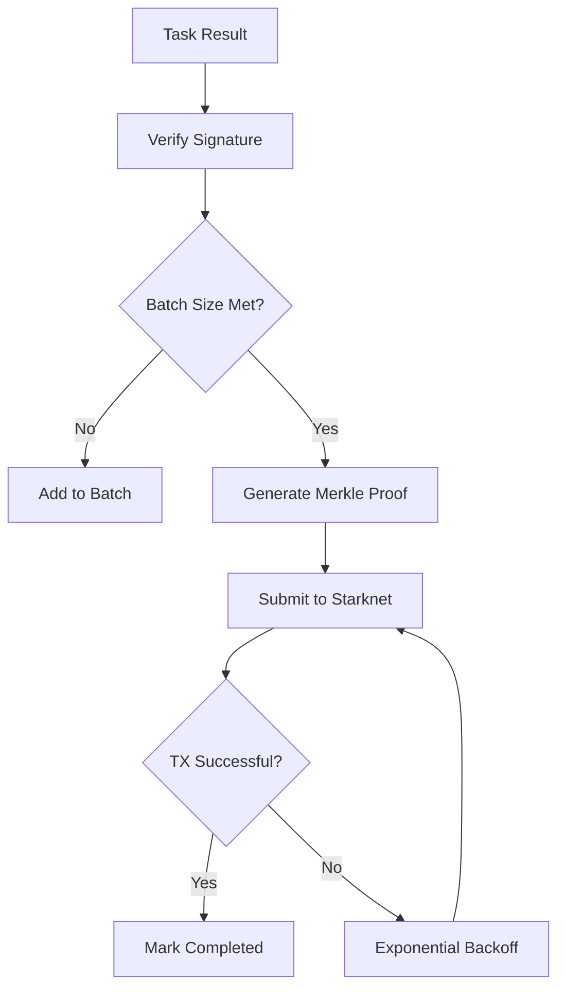
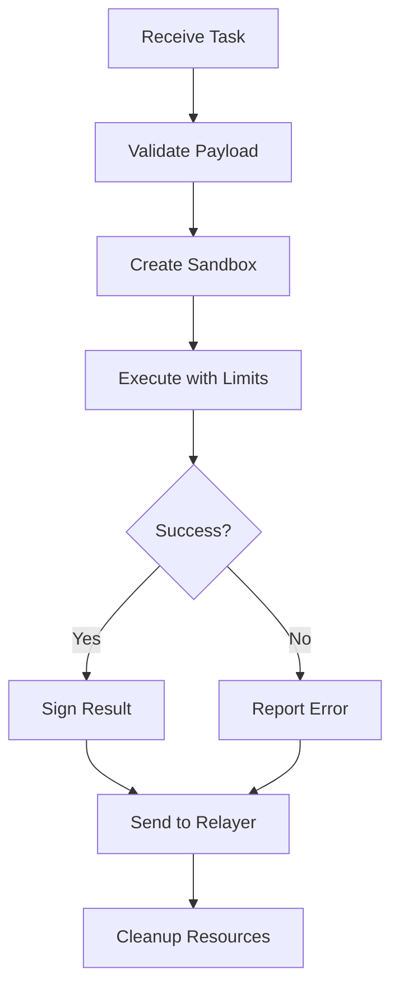
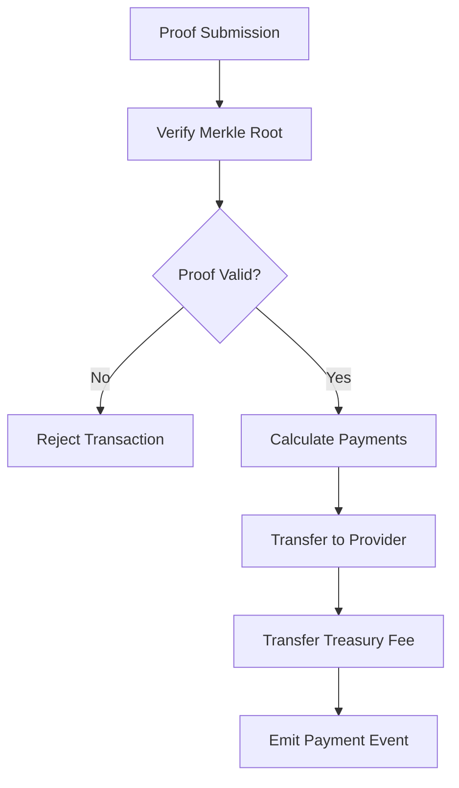
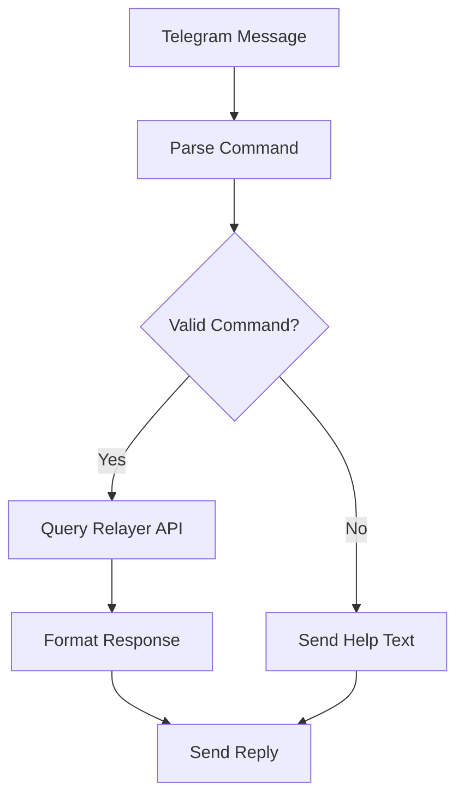

# SMAINER SYSTEM ARCHITECTURE

## Purpose

Complete system architecture documentation for the Smainer decentralized compute-sharing protocol on Starknet. This document outlines component interactions, data flow, deployment topology, and operational status for the multi-component distributed system enabling GPU providers to earn STRK tokens by executing compute tasks submitted by demanders.

---

## What is Redis in Smainer?

Redis serves as the **central coordination backbone** for real-time event orchestration and state management across the distributed Smainer system.

### Practical Role and Usage:

- **Event Streams**: Redis Streams power the event-driven architecture, replacing 5-second polling with <100ms latency pub/sub coordination between relayer components
- **Task Queues**: Weighted fair queuing with tier-based priority (Basic=1.0, Pro=0.7, Premium=0.5) prevents task starvation while maintaining SLA targets
- **Node State**: WebSocket connection registry, hardware capabilities (GPU VRAM, thermal status), and heartbeat tracking for provider daemon lifecycle management  
- **Result Batching**: Temporary storage for aggregating compute results before on-chain submission to minimize gas costs
- **Rate Limiting**: Sliding window counters using sorted sets for API throttling and DDoS protection
- **TTL Management**: Automatic cleanup of stale connections, expired task assignments, and temporary result storage
- **Circuit Breaker State**: Failure count tracking and exponential backoff timing for resilience patterns

Key Redis patterns: Streams for event coordination, sorted sets for rate limiting, hashes for node capabilities, lists for task queues, and TTL-based cleanup automation.

---

## Where Each Component Runs

| Component | Runtime Location | Ownership | Network Access |
|-----------|-----------------|-----------|----------------|
| **Relayer API** | Docker container @ port 8000 (fallback: 8001) | Smainer team (centralized) | FastAPI/uvicorn with WebSocket endpoints |
| **Orchestration** | Same container as Relayer | Smainer team | Redis Streams coordination, batch processing |
| **Provider Daemon** | User machines (distributed) | Individual providers | Python subprocess, WebSocket client to relayer |
| **Telegram Bot** | VPS/cloud instance | Smainer team | Polling mode, webhook callbacks to bot handlers |
| **Frontend** | Vercel deployment | Smainer team | Next.js SSR, starknet-react wallet connection |
| **Smart Contract** | Starknet L2 network | Immutable on-chain | Cairo VM execution, deployed at known addresses |

**Central Coordination**: The relayer runs on Smainer-controlled infrastructure and coordinates all distributed provider daemons through WebSocket connections and Redis state management.

---

## Event-Driven Design

The system follows event-driven architecture with Redis Streams orchestrating async coordination:

- Task submitted frontend → TASK_SUBMITTED event  
- Scheduler evaluates VRAM/thermal constraints → TASK_ASSIGNED event
- Provider daemon processes task → TASK_COMPLETED event
- Result aggregator batches outputs → BATCH_READY event  
- Smart contract proof submission → PROOF_VERIFIED event
- Payment distribution triggers → PAYMENT_PROCESSED event
- Node disconnection cleanup → NODE_OFFLINE event



---

## High-Responsibility Black Boxes

| Black Box | Responsibilities | Inputs | Outputs | State Store | Hardware/Runtime |
|-----------|-----------------|--------|---------|-------------|------------------|
| **Relayer Gateway** | HTTP API, WebSocket server, auth | REST requests, WS connections | JSON responses, events | Redis (connections) | FastAPI container, 2GB RAM |
| **WebSocket Manager** | Provider connections, heartbeats | Node capabilities, status | Connection events | Redis (node registry) | Async Python, 1GB RAM |
| **Scheduler** | GPU-aware task assignment, WFQ | Task queue, node capacity | Assignment events | Redis (queues) | CPU-intensive, 512MB RAM |
| **Result Aggregator** | Proof batching, on-chain submission | Task results, signatures | Batch transactions | Redis (batches) | Network I/O, 256MB RAM |
| **Provider Daemon** | Task execution, sandboxing | Task payloads via WS | Signed results | Local process state | GPU access, 4GB+ RAM |
| **Smart Contract Escrow** | Payment distribution, verification | Proof submissions | STRK transfers | On-chain storage | Starknet VM gas limits |
| **Telegram Bot** | User notifications, task status | Webhook callbacks | Bot messages | Local bot state | Polling, 128MB RAM |

---

## Logic and Data Flow by Black Box

### Relayer Gateway

**Logic Flow:**
- Accept REST API calls for task submission and status queries
- Authenticate requests using API keys or wallet signatures  
- Route WebSocket connections to node management subsystem
- Enforce rate limits using Redis sliding window counters
- Return standardized JSON responses with proper error handling

**Data Flow:**
- Inbound: Task submission JSON, WebSocket handshake headers
- Processing: Validate payload schema, check authentication
- Outbound: Task IDs, status updates, WebSocket connection confirmation



### WebSocket Manager

**Logic Flow:**
- Maintain persistent connections with provider daemons
- Register node capabilities (GPU model, VRAM, thermal limits)
- Handle heartbeat monitoring and connection cleanup
- Route task assignments to appropriate connected nodes
- Buffer results until batch aggregation triggers

**Data Flow:**  
- Inbound: Node registration, heartbeats, task results
- Processing: Update Redis node registry, validate signatures
- Outbound: Task assignments, keepalive pings, disconnect commands



### Scheduler

**Logic Flow:**
- Monitor Redis task queues with weighted fair queuing
- Score available nodes by GPU utilization and thermal status
- Apply anti-starvation aging for long-waiting tasks
- Implement circuit breakers for repeatedly failing nodes  
- Trigger exponential backoff for node assignment failures

**Data Flow:**
- Inbound: Task queue events, node capability updates
- Processing: VRAM requirement matching, thermal constraint evaluation
- Outbound: Task assignment events, node scoring metrics



### Result Aggregator

**Logic Flow:**
- Collect completed task results from Redis streams
- Verify cryptographic signatures using provider public keys
- Batch results based on configurable size/time triggers
- Generate Merkle proofs for efficient on-chain verification
- Submit batch transactions to Starknet with retry logic

**Data Flow:**
- Inbound: Signed task results, cryptographic proofs  
- Processing: Signature verification, batch assembly, Merkle tree construction
- Outbound: Batch transaction payloads, proof verification calls



### Provider Daemon

**Logic Flow:**
- Establish WebSocket connection to relayer with authentication
- Register hardware capabilities and maintain heartbeat
- Execute tasks in sandboxed subprocess with resource limits
- Sign results using Starknet ECDSA private key
- Handle graceful shutdown and process cleanup

**Data Flow:**
- Inbound: Task assignments with execution parameters
- Processing: Sandbox execution, resource monitoring, result computation
- Outbound: Signed results, system metrics, heartbeat confirmations



### Smart Contract Escrow

**Logic Flow:**
- Accept task deposits with STRK token escrow
- Verify cryptographic proofs submitted by relayer
- Calculate payment splits (85% provider, 12% treasury, 3% gas subsidy)
- Execute automated token transfers on proof verification
- Emit events for payment tracking and reconciliation

**Data Flow:**
- Inbound: Task deposits, batch proof submissions
- Processing: Proof verification, payment calculation, fee distribution
- Outbound: STRK transfers, payment events, transaction confirmations



### Telegram Bot

**Logic Flow:**
- Poll Telegram API for user messages and commands
- Parse user intents (task status, balance queries, node management)
- Query relayer API for real-time system status
- Format responses with task progress and earnings data
- Handle webhook callbacks for payment notifications

**Data Flow:**
- Inbound: Telegram messages, webhook callbacks from payment system
- Processing: Command parsing, API queries, response formatting
- Outbound: Bot messages, status updates, notification alerts



---

## Operational Status (as of Mar 13, 2026)

### Smart Contract Deployment
**Status**: ✅ LIVE on Starknet Sepolia testnet  
**Address**: `0x0366d48173adee841c666569fc03ba654a720aa83dfe117393c1b8866c1ea893`  
**Verification**: Payments working, escrow tested, fee distribution confirmed

### Backend Components
**Relayer API**: ⚠️ HIGH test readiness, pending release-gate hardening  
**Provider Daemon**: ⚠️ HIGH test readiness, WebSocket coordination stable  
**Integration Gaps**: Enhanced orchestration needs end-to-end validation, Redis Streams coordination requires load testing

### Telegram Bot  
**Status**: ⚠️ READY for polling-mode deployment now
**Blocker**: For automatic final inference result messages, relayer must reach bot callback endpoint (`/callback/complete`). Telegram webhook URL is not required for polling mode.

### Frontend
**Status**: ⚠️ READY with wallet integration, task submission flows tested  
**Blocker**: Production RPC configuration and contract address updates

### Infrastructure
**Redis**: Local development only, production cluster setup pending  
**Monitoring**: Basic logging implemented, metrics collection incomplete

---

## ASAP Test/Deploy Timeline (72-Hour Plan)

### Hour 0-24: Daemon Testing
```bash
# IMMEDIATE: Start relayer in first terminal
cd /home/smainer/Smainer/backend/relayer && source /home/smainer/Smainer/.venv/bin/activate && pip install -e . && uvicorn relayer.main:app --host 0.0.0.0 --port 8000
# Note: If port 8000 is occupied, use --port 8001 and update RELAYER_API_URL accordingly

# Start provider daemon in second terminal
cd /home/smainer/Smainer/backend/provider && source /home/smainer/Smainer/.venv/bin/activate && RELAYER_WS_URL=ws://localhost:8000 provider-daemon
```
**Expected**: WebSocket connection, capability registration, mock task execution  
**Blocker**: Relayer must be running with Redis backend accessible

### Hour 24-48: Telegram Bot Deploy
```bash
# Deploy telegram bot in polling mode
export TELEGRAM_BOT_TOKEN="your-bot-token"
export RELAYER_API_URL="https://api.smainer.io"
cd /home/smainer/Smainer/telegram/telegram-bot && source /home/smainer/Smainer/.venv/bin/activate && pip install -e . && smainer-telegram-bot
```
**Expected**: Bot responds to /status, /balance commands  
**Blocker**: Production bot token provisioning, API endpoint configuration. Note: Polling mode does NOT need Telegram webhook URL. Relayer->bot callback endpoint is still needed for automatic final inference result messages.

### Hour 48-72: End-to-End Integration
```bash
# Full integration test sequence  
1. Start relayer with Redis backend
2. Connect provider daemon
3. Submit task via frontend  
4. Verify bot notification
5. Check on-chain payment
```
**Expected**: Complete task flow from submission to payment  
**Blockers**: Production environment coordination, testnet gas funding

### Critical Dependencies
- **Redis production cluster**: Required for event coordination
- **Starknet RPC access**: Infura/Alchemy API keys for mainnet readiness
- **Public callback reachability**: relayer must reach bot callback endpoint (HTTPS recommended in production)
- **Gas funding**: STRK tokens for testnet transaction execution

---

## Immediate Next Actions

1. **Deploy Redis cluster**: Configure production Redis with persistence and clustering for high availability
2. **Test provider daemon**: Run local daemon against development relayer with mock task execution  
3. **Deploy telegram bot**: Configure polling-mode bot for immediate user interaction testing
4. **Setup monitoring**: Implement health checks, error tracking, and performance metrics collection
5. **Provision testnet funds**: Fund deployment wallets with STRK tokens for transaction execution
6. **Configure production RPC**: Set up Starknet API endpoints with proper rate limiting and redundancy
7. **Test end-to-end flow**: Execute complete task submission to payment verification sequence
8. **Harden release gates**: Complete security audit checklist and penetration testing requirements
9. **Deploy frontend**: Update contract addresses and deploy to production Vercel environment
10. **Document runbooks**: Create operational procedures for deployment, monitoring, and incident response

**Priority Order**: Redis deployment → Daemon testing → Bot deployment → E2E validation → Production hardening