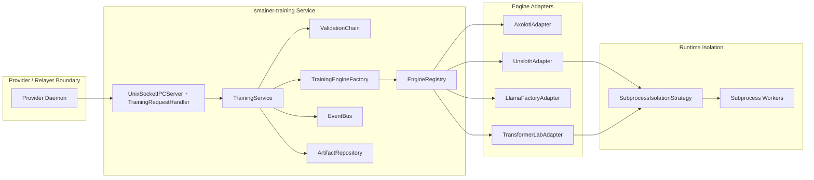
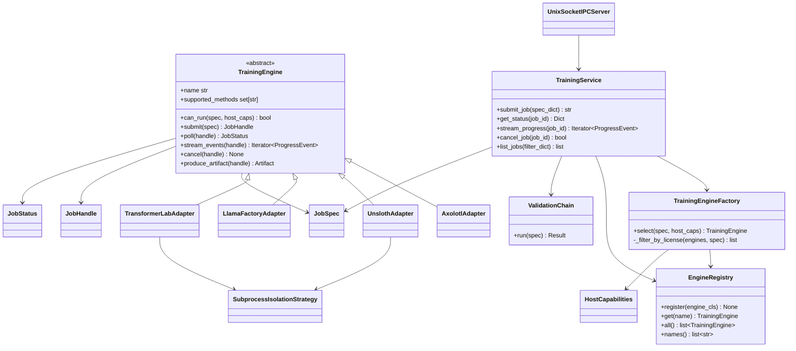
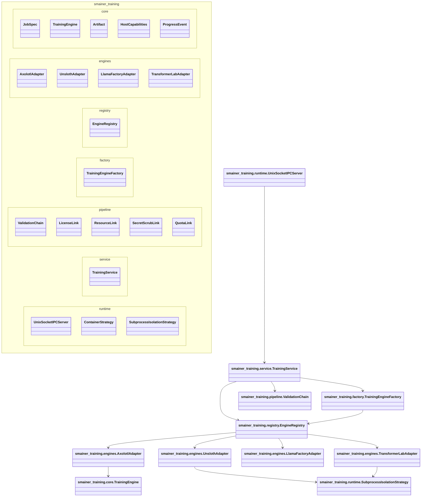

# smainer-training

**Decoupled Training Engine Adapter Framework for Smainer**

A pluggable, subprocess-isolated training pipeline for fine-tuning transformer models via the Smainer relayer. Decoupled from `smainer-backend/` to keep AGPL-licensed engines (TransformerLab, Axolotl with certain configs) out of the core backend deployment.

## Why Decouple?

**License Isolation**:  
TransformerLab and other training engines carry AGPL or restrictive licenses. Smainer's backend (`smainer-backend/`) is Apache-2.0. Rather than pull AGPL into the backend dependency tree, we:
- **Deploy training as a separate service/container** with its own Python environment.
- **Communicate via subprocess + IPC** (no direct imports of AGPL code into Apache-2.0 backend).
- **Enforce CI checks** (`HC-10`: `pip-licenses` scan) to ensure no AGPL packages leak into backend builds.

**Operational Isolation**:  
Training jobs are unpredictable (can OOM, hang, crash). By running as a separate process/container, a broken training job doesn't crash the relayer.

---

## Architecture: Engine-Plugin Model

`smainer-training` exposes a unified `TrainingEngine` contract, validation pipeline, and engine selection flow. Wave 2-5 adapters are implemented in `src/smainer_training/engines`.

### End-to-End Training Flow Diagram

```mermaid
flowchart TD
  A[Provider Daemon / Relayer] -->|POST /jobs + Bearer token| B[UnixSocketIPCServer]
  B --> C[TrainingService.submit_job]
  C --> D[Parse JobSpec]
  D --> E[ValidationChain\nLicense -> Resource -> SecretScrub -> Quota]
  E --> F[TrainingEngineFactory.select]
  F --> G[EngineRegistry.all]
  G --> H{Compatible engine?}
  H -->|Yes| I[Adapter.submit]
  H -->|No| X[EngineUnavailable / LicenseViolation]
  I --> J{AGPL engine?}
  J -->|Yes| K[SubprocessIsolationStrategy.launch]
  J -->|No| L[Adapter subprocess/in-process path]
  K --> M[Isolated worker process]
  L --> M
  M --> N[ProgressEvent stream + JobStatus polling]
  M --> O[Artifact production]
  N --> B
  O --> B
  B --> P[GET /jobs/{id}, /jobs/{id}/events]
```

### UML Component Diagram



Component diagram guidance:
- Component diagrams depict structural relationship between software elements and help validate functional coverage.
- They are essential for complex systems where multiple subsystems evolve independently.
- Interfaces are used by components to communicate across clear boundaries.
- In modern microservices usage, component diagrams clarify service boundaries, API contracts, and communication paths.

### UML Deployment Diagram

```mermaid
flowchart TB
  subgraph HostA[Provider Host]
    PD[Provider Daemon]
    SOCK[/run/smainer-training.sock]
  end

  subgraph HostB[Training Host / Container]
    DAEMON[smainer_training __main__ daemon]
    IPC2[UnixSocketIPCServer]
    CORE[TrainingService + Factory + Registry + ValidationChain]
    ADP[Engine Adapters]
    ISO2[SubprocessIsolationStrategy]
    W1[Unsloth Worker Process]
    W2[TransformerLab Worker Process]
    W3[Axolotl/LlamaFactory Process]
    ART[Artifact Output Storage]
  end

  PD --> SOCK
  SOCK --> IPC2
  IPC2 --> DAEMON
  DAEMON --> CORE
  CORE --> ADP
  ADP --> ISO2
  ISO2 --> W1
  ISO2 --> W2
  ADP --> W3
  W1 --> ART
  W2 --> ART
  W3 --> ART
```

### UML Class Diagram



### UML Package Diagram



### TrainingEngine Interface

Each adapter (Axolotl, Unsloth, LLaMA-Factory, TransformerLab) implements:

```python
from abc import ABC, abstractmethod
from typing import Iterator

class TrainingEngine(ABC):
    @abstractmethod
    def name(self) -> str:
        """Engine identifier."""
        pass

    @abstractmethod
    def supported_methods(self) -> set[str]:
        """Training methods supported by this engine."""
        pass

    @abstractmethod
    def can_run(self, spec, host_caps) -> bool:
        """Capability and host compatibility check."""
        pass

    @abstractmethod
    def submit(self, spec):
        """Submit job and return a JobHandle."""
        pass

    @abstractmethod
    def poll(self, handle):
        """Poll job status."""
        pass

    @abstractmethod
    def stream_events(self, handle) -> Iterator:
        """Yield progress events."""
        pass

    @abstractmethod
    def cancel(self, handle) -> None:
        """Cancel a job."""
        pass

    @abstractmethod
    def produce_artifact(self, handle):
        """Produce final output artifact for a completed job."""
        pass
```

---

## Supported Engines

| Engine | License | Status | Scope |
|--------|---------|--------|-------|
| **Axolotl** | Apache-2.0 | ✅ Implemented (Wave 2) | Multi-engine orchestration |
| **Unsloth** | AGPL-3.0 | ✅ Implemented (Wave 3) | AGPL + 4-bit quantization |
| **LLaMA-Factory** | Apache-2.0 | ✅ Implemented (Wave 4) | Flexible config format |
| **TransformerLab** | AGPL-3.0 | ✅ Implemented (Wave 5) | Research-oriented, subprocess only |

All four adapters are included in the golden engine contract test matrix (`tests/test_golden_engine_contract.py`).

### AGPL Boundary

**Engines with AGPL licenses MUST only be invoked via subprocess/IPC**, never imported directly into `smainer-backend/`:
- TransformerLab (AGPL-3.0)
- Axolotl (Apache-2.0, but may pull AGPL transitive deps)
- Unsloth (AGPL-3.0)

**Apache-2.0 compatible**:
- LLaMA-Factory (Apache-2.0)

Enforce in CI (`HC-10`): If any AGPL package is found in `pip-licenses` output for `smainer-backend/`, build fails.

---

## Vendor Bumps: Git Subtree Pattern

Training engines live in `vendors/`:

```bash
# Add Axolotl as subtree at v0.3.0
git subtree add --prefix vendors/axolotl https://github.com/OpenAccess-AI-Collective/axolotl.git v0.3.0

# Update to latest stable
git subtree pull --prefix vendors/axolotl https://github.com/OpenAccess-AI-Collective/axolotl.git main --squash

# Commit integration
git commit -m "chore(vendors): bump axolotl to v0.4.0"
```

See [vendors/README.md](vendors/README.md) for detailed procedure.

---

## Quick Start

For full operator documentation, see [docs/USAGE.md](docs/USAGE.md).

### Install for Development

```bash
cd smainer-training
pip install -e ".[dev]"
```

### Run Tests

```bash
pytest tests/
ruff check .
mypy src/
```

### Add a New Engine Adapter

1. Create `src/smainer_training/engines/my_engine.py` inheriting `TrainingEngine`.
2. Implement `name`, `supported_methods`, `can_run()`, `submit()`, `poll()`, `stream_events()`, `cancel()`, and `produce_artifact()`.
3. Add tests to `tests/test_my_engine.py` (must pass golden test suite).
4. Update `vendors/README.md` if adding a vendored dependency.
5. Open PR; `security-expert` + `relayer-architect` must review.

See [CONTRIBUTING.md](CONTRIBUTING.md) for full guide.

---

## CI/CD Enforcements

### `ci.yml`
Runs pytest, ruff, mypy in isolation (NOT in `smainer-backend` workflow).

### `forbidden-imports.yml`
**HC-1**: Scans for `import smainer_backend.*` or `from smainer_backend` → fails if found.

```bash
if grep -r "import smainer_backend\|from smainer_backend" src/ tests/; then
  echo "ERROR: smainer-backend import detected. Use IPC/subprocess instead."
  exit 1
fi
```

### `license-scan.yml`
**HC-10**: Runs `pip-licenses --format=json` and rejects AGPL packages.

```bash
pip-licenses --format=json | grep -i "agpl" && exit 1
echo "✓ License scan passed (no AGPL in installed environment)"
```

### `docker-publish.yml`
Builds `ghcr.io/smainer/smainer-training:vX.Y.Z`.  
**HC-5**: Rejects `latest` tag; only semver tags allowed.

```bash
if [[ "$TAG" == "latest" ]]; then
  echo "ERROR: 'latest' tag forbidden. Use semver (vX.Y.Z)."
  exit 1
fi
```

---

## Deployment

### As a Standalone Service

```bash
docker pull ghcr.io/smainer/smainer-training:v0.1.0
docker run -d \
  --name smainer-training \
  -e REDIS_URL=redis://relayer:6379 \
  ghcr.io/smainer/smainer-training:v0.1.0
```

### Integration with Relayer

Relayer sends training job requests via Redis/IPC:

```python
# In smainer-backend/relayer/
result = subprocess.run(
    ["python", "-m", "smainer_training", "train"],
    input=json.dumps({
        "job_id": "42",
        "engine": "transformerlab",
        "config": {...}
    }),
    capture_output=True,
    text=True,
    timeout=3600,
)
```

No direct import of AGPL code; subprocess handles it.

---

## License

Apache License 2.0. See [LICENSE](LICENSE) for details.

**Engine adapters may depend on AGPL packages**, but only when running as an isolated subprocess, never imported into Apache-2.0 services.

---

## Governance

- **Reviewers**: `security-expert`, `relayer-architect` (required for PRs to core engine interfaces)
- **Engine contributions**: Must pass golden test suite and license audit
- **Release**: Semver only; use `git tag v0.1.0` and push to trigger `docker-publish.yml`

See [CODEOWNERS](CODEOWNERS) and [CONTRIBUTING.md](CONTRIBUTING.md).
